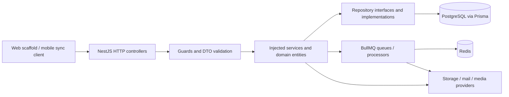

# System architecture

Architecture changes require the [Senior Software Architect](../roles/architecture-lead.md) perspective and an evidence-backed reason the existing approach is insufficient. Cross-module work adds Senior Tech Lead impact/validation/recovery assessment; record consequential choices in [decisions](../decisions/README.md).

## Runtime flow

`apps/api/src/app.module.ts` registers auth, users, farms, animals, milk-logs, clinical-health, financial, subscriptions, consultations, products, media, orders, watermark, mail, audit, health, Prisma, sync and idempotency. This is a modular monolith, not separately deployed domain microservices. Worker processors are included through feature modules; a separate production worker deployment is not established by this diagram.

## Layer and dependency conventions

- Controllers handle transport, DTOs, decorators and delegation. Some are at module root; larger modules use `controllers/`. Match the target module rather than moving files for uniformity.
- Services implement use cases with injected interface tokens; entities capture domain state and behavior. Interfaces and tokens commonly share `*.interface.ts` files.
- Repositories own Prisma queries, tenant filters, ORM/domain mapping and persistence error translation. Avoid leaking ORM objects as public contracts.
- Nest modules bind tokens with `useClass`, `useExisting` or provider factories, and import required modules. Inspect imports/exports when introducing guards: `JwtAuthGuard` needs `TOKEN_SERVICE` from auth.
- `packages/shared-types/src/index.ts` and its barrels export contracts consumed by API/web; Dart models require explicit synchronization.

Concrete reference: `modules/animals/animals.controller.ts` → `services/animals.service.ts` (`AnimalsService`) → `repositories/animal.repository.interface.ts` / `animal.repository.ts` (`AnimalRepository`) → `entities/animal.entity.ts`. `AnimalsService.registerAnimal` uses `ITransactionManager.run` and passes the same transaction to persistence and `AuditLogRepository.record`.

`modules/prisma/interfaces/transaction.interface.ts` exposes `TRANSACTION_MANAGER` and `ITransactionManager`. Its transaction type currently references Prisma; do not claim complete framework independence across all interfaces. New business queries should stay behind repositories rather than expanding direct ORM access in services.

## Cross-cutting boundaries

`ResponseInterceptor` and `GlobalExceptionFilter` implement normal HTTP envelopes. `JwtAuthGuard`, `RolesGuard`, `TenantGuard` enforce access only where wired. Subscription guards add feature/quota/access checks. WebSocket chat in `modules/consultations/gateways/consultation-chat.gateway.ts` has a separate handshake/message boundary; HTTP guard behavior is not automatically inherited.

`PrismaService` connects with bounded retry, logs slow queries and disconnects on module destruction. A configured `DATABASE_REPLICA_URL` is not evidence that read routing exists. Logging currently uses Nest `Logger`, not the Pino integration described in older rules.

For bootstrap differences, worker/runtime constraints and external provider behavior, see [operations](../operations/runtime.md). For decisions and their trade-offs, see [decision records](../decisions/README.md).
