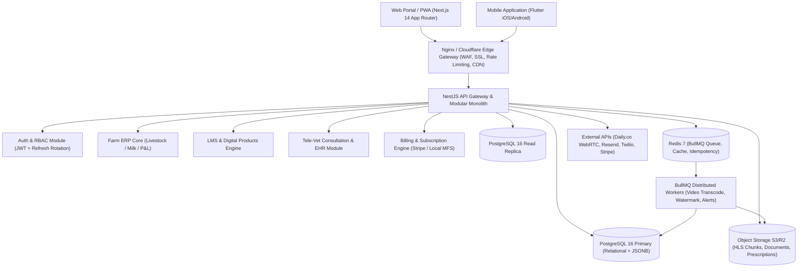
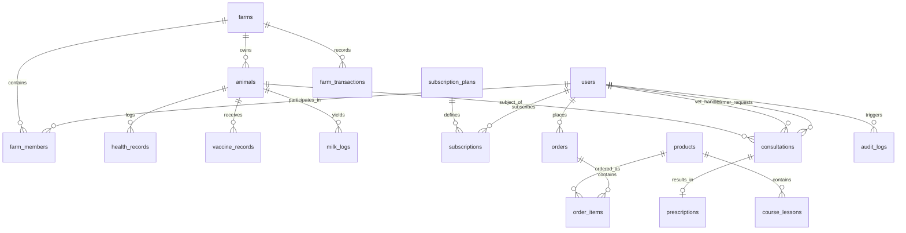

# VETRALINK PRO — System Architecture Document
# Version: 1.0.0 | Last Updated: 2026-09-05
# Status: PRODUCTION SPECIFICATION & LIVING ARCHITECTURAL BLUEPRINT

---

## 1. SYSTEM OVERVIEW & ARCHITECTURAL PRINCIPLES

VETRALINK PRO is a multi-tenant, cloud-native AgTech platform synthesizing three core enterprise capabilities:
1. **Multi-Species Farm SaaS ERP**: Livestock lifecycle tracking, milk yields, vaccination schedules, farm financial ledger & P&L.
2. **LMS & Digital Assets Marketplace**: Doctor-verified video courses (HLS/DRM), encrypted eBooks, and Excel ROI/feed templates with dynamic buyer watermarking.
3. **Tele-Veterinary Telehealth & EHR**: Triage, WebRTC video/chat consultations, linked animal Electronic Health Records (EHR), and digitally signed PKI PDF prescriptions.

### Non-Functional Requirements & Architecture Pillars
- **Strict Clean Architecture (Hexagonal / Ports & Adapters)**:
  `Controller -> Service (Use Cases) -> Domain (Entities & Business Rules) -> Repository (Data Access)`.
- **Multi-Tenant Data Isolation**: Every transactional query scopes strictly by `farm_id` / `tenant_id`.
- **Strict Typing**: TypeScript 5.x with zero `any`, strict null checks, and Zod/class-validator boundaries.
- **ACID Financial Integrity**: All order placement, balance mutations, and subscription status changes are executed inside explicit database transactions.
- **Offline-First Readiness**: Edge and mobile synchronization capabilities for rural, low-bandwidth farm environments.

---

## 2. HIGH-LEVEL SYSTEM TOPOLOGY



---

## 3. MONOREPO & DIRECTORY STRUCTURE

**Workspace Tool**: Turborepo + `pnpm` workspaces

```
vetralink-pro/
├── .antigravityrules                 # Non-negotiable agent engineering rules
├── ARCHITECTURE.md                   # This system design & architectural specification
├── ROADMAP.md                        # Phased implementation & sprint tracking
├── pnpm-workspace.yaml               # Workspace definitions
├── turbo.json                        # Pipeline caching and build matrix
├── package.json
│
├── apps/
│   ├── api/                          # NestJS 10.x API Core
│   │   ├── src/
│   │   │   ├── main.ts               # Bootstrapper (Helmet, CORS, Interceptors, Pipes)
│   │   │   ├── app.module.ts         # Module composition root
│   │   │   ├── config/               # Zod-validated environment config
│   │   │   │   ├── env.schema.ts
│   │   │   │   └── env.service.ts
│   │   │   ├── common/
│   │   │   │   ├── decorators/       # @CurrentUser, @Roles, @Tenant
│   │   │   │   ├── dto/              # ApiResponse<T>, PaginationMetaDto
│   │   │   │   ├── exceptions/       # DomainException, NotFoundException
│   │   │   │   ├── filters/          # GlobalExceptionFilter
│   │   │   │   ├── guards/           # JwtAuthGuard, RolesGuard, TenantGuard
│   │   │   │   ├── interceptors/     # ResponseInterceptor, LoggingInterceptor
│   │   │   │   └── pipes/            # Custom validation pipes
│   │   │   └── modules/
│   │   │       ├── auth/             # Authentication & Refresh Token Rotation
│   │   │       ├── users/            # Profiles, Roles, PII encryption
│   │   │       ├── farms/            # Multi-tenant farm & member management
│   │   │       ├── animals/          # Multi-species animal registry
│   │   │       ├── health/           # Vaccinations, deworming, clinical events
│   │   │       ├── milk-logs/        # Session milk yields & trend analytics
│   │   │       ├── financial/        # Ledger expenses, feed costs, P&L
│   │   │       ├── products/         # Courses, eBooks, Excel toolkits
│   │   │       ├── orders/           # Checkouts, payment webhooks, fulfillment
│   │   │       ├── subscriptions/    # Tier limits, dunning, billing intervals
│   │   │       ├── consultations/    # Tele-vet triage, WebRTC sessions, notes
│   │   │       ├── prescriptions/    # PKI digital signature, signed PDF generation
│   │   │       └── audit/            # Tamper-evident CUD audit trails
│   │   ├── prisma/
│   │   │   ├── schema.prisma         # Production 3NF database schema
│   │   │   ├── migrations/           # Versioned migration logs
│   │   │   └── seed.ts               # System roles, test tenants, subscription tiers
│   │   ├── test/                     # Unit (Jest) & E2E (Supertest) suites
│   │   └── Dockerfile
│   │
│   ├── web/                          # Next.js 14 (App Router, Server Components)
│   │   ├── src/
│   │   │   ├── app/                  # Routes: (auth), (erp), (store), (vet), (admin)
│   │   │   ├── components/           # Atomic UI & dashboard widgets
│   │   │   ├── hooks/                # React query & state hooks
│   │   │   ├── lib/                  # Fetch client with token refresh
│   │   │   └── store/                # Zustand client state
│   │   └── Dockerfile
│   │
│   └── mobile/                       # Flutter 3.x (Cross-platform iOS/Android)
│       ├── lib/
│       │   ├── core/                 # Offline sync, SQLite, HTTP interceptors
│       │   ├── features/             # BLoC architecture (auth, erp, store, vet)
│       │   └── shared/               # Reusable UI widgets & themes
│       └── pubspec.yaml
│
├── packages/
│   ├── shared-types/                 # Universal TypeScript interfaces & enums
│   ├── ui-kit/                       # Reusable Tailwind UI components
│   └── tsconfig/                     # Shared TypeScript configuration presets
│
├── infrastructure/
│   ├── docker-compose.yml            # Local Postgres 16, Redis 7, MinIO
│   ├── nginx/                        # Reverse proxy & rate limiting config
│   └── workers/                      # Background processors (Gotenberg / Transcoder)
│
└── docs/                             # Spec-Driven Development documentation
    ├── features/                     # Feature-level specifications and execution plans
    │   └── sprint-0-bootstrap/       # Sprint 0 spec.md and plan.md
    └── tasks/                        # Ad-hoc task and bugfix documentation
```

---

## 4. 3NF DATABASE ENTITY MAP & DATA DICTIONARY

All tables are strictly normalized in **Third Normal Form (3NF)** with explicit foreign key constraints, composite uniqueness rules, and indexing for low-latency queries.

### Entity Relationship Diagram (ERD)



### Table Definitions & Constraints

#### 1. `users`
- `id` (UUID, PK, `gen_random_uuid()`)
- `email` (VARCHAR 255, UNIQUE, NOT NULL)
- `phone` (VARCHAR 32, UNIQUE, NULLABLE) — Encrypted AES-256-GCM
- `password_hash` (VARCHAR 255, NOT NULL) — bcrypt (12 rounds)
- `name` (VARCHAR 100, NOT NULL)
- `role` (ENUM: `SUPER_ADMIN`, `ADMIN`, `VET`, `FARMER`, `BUYER`)
- `status` (ENUM: `ACTIVE`, `SUSPENDED`, `PENDING_VERIFICATION`)
- `avatar_url` (TEXT, NULLABLE)
- `created_at` (TIMESTAMPTZ, DEFAULT NOW())
- `updated_at` (TIMESTAMPTZ, DEFAULT NOW())
- `deleted_at` (TIMESTAMPTZ, NULLABLE) — Soft delete

#### 2. `refresh_tokens`
- `id` (UUID, PK)
- `user_id` (UUID, FK -> `users.id` ON DELETE CASCADE)
- `token_hash` (VARCHAR 255, UNIQUE, NOT NULL)
- `expires_at` (TIMESTAMPTZ, NOT NULL)
- `revoked_at` (TIMESTAMPTZ, NULLABLE)
- `ip_address` (INET, NULLABLE)
- `user_agent` (TEXT, NULLABLE)
- `created_at` (TIMESTAMPTZ, DEFAULT NOW())

#### 3. `farms` (Tenant Entity)
- `id` (UUID, PK)
- `owner_id` (UUID, FK -> `users.id`)
- `name` (VARCHAR 150, NOT NULL)
- `slug` (VARCHAR 120, UNIQUE, NOT NULL)
- `farm_type` (ENUM: `DAIRY`, `BEEF`, `POULTRY`, `GOAT_SHEEP`, `MIXED`)
- `country` (VARCHAR 100, NOT NULL)
- `address` (TEXT, NULLABLE)
- `gps_lat` (DECIMAL(10, 7), NULLABLE)
- `gps_lng` (DECIMAL(10, 7), NULLABLE)
- `settings` (JSONB, DEFAULT '{}')
- `created_at` (TIMESTAMPTZ, DEFAULT NOW())
- `updated_at` (TIMESTAMPTZ, DEFAULT NOW())
- `deleted_at` (TIMESTAMPTZ, NULLABLE)

#### 4. `farm_members` (Junction Table)
- `id` (UUID, PK)
- `farm_id` (UUID, FK -> `farms.id` ON DELETE CASCADE)
- `user_id` (UUID, FK -> `users.id` ON DELETE CASCADE)
- `role` (ENUM: `OWNER`, `MANAGER`, `HERDSMAN`, `VET_STAFF`)
- `created_at` (TIMESTAMPTZ, DEFAULT NOW())
- **Constraint**: UNIQUE(`farm_id`, `user_id`)

#### 5. `animals`
- `id` (UUID, PK)
- `farm_id` (UUID, FK -> `farms.id` ON DELETE RESTRICT)
- `tag_number` (VARCHAR 50, NOT NULL)
- `name` (VARCHAR 100, NULLABLE)
- `species` (ENUM: `COW`, `BUFFALO`, `GOAT`, `SHEEP`, `CAMEL`, `POULTRY`, `OTHER`)
- `breed` (VARCHAR 100, NULLABLE)
- `gender` (ENUM: `MALE`, `FEMALE`)
- `date_of_birth` (DATE, NULLABLE)
- `weight_kg` (DECIMAL(6,2), NULLABLE)
- `status` (ENUM: `ACTIVE`, `QUARANTINE`, `SOLD`, `DECEASED`, `CULLED`)
- `sire_id` (UUID, FK -> `animals.id`, NULLABLE)
- `dam_id` (UUID, FK -> `animals.id`, NULLABLE)
- `metadata` (JSONB, DEFAULT '{}')
- `created_at` (TIMESTAMPTZ, DEFAULT NOW())
- `updated_at` (TIMESTAMPTZ, DEFAULT NOW())
- `deleted_at` (TIMESTAMPTZ, NULLABLE)
- **Constraint**: UNIQUE(`farm_id`, `tag_number`, `deleted_at`)

#### 6. `health_records`
- `id` (UUID, PK)
- `farm_id` (UUID, FK -> `farms.id`)
- `animal_id` (UUID, FK -> `animals.id`)
- `recorded_by` (UUID, FK -> `users.id`)
- `attending_vet_id` (UUID, FK -> `users.id`, NULLABLE)
- `event_type` (ENUM: `ILLNESS`, `INJURY`, `SURGERY`, `ROUTINE_CHECK`, `BREEDING_EXAM`)
- `severity` (ENUM: `LOW`, `MEDIUM`, `HIGH`, `CRITICAL`)
- `symptoms` (TEXT, NOT NULL)
- `diagnosis` (TEXT, NULLABLE)
- `treatment` (TEXT, NULLABLE)
- `cost` (DECIMAL(10,2), DEFAULT 0)
- `resolved_at` (TIMESTAMPTZ, NULLABLE)
- `created_at` (TIMESTAMPTZ, DEFAULT NOW())

#### 7. `vaccine_records`
- `id` (UUID, PK)
- `farm_id` (UUID, FK -> `farms.id`)
- `animal_id` (UUID, FK -> `animals.id`)
- `administered_by` (UUID, FK -> `users.id`)
- `vaccine_name` (VARCHAR 150, NOT NULL)
- `batch_number` (VARCHAR 100, NULLABLE)
- `dose_amount` (DECIMAL(6,2), NOT NULL)
- `dose_unit` (VARCHAR(20), DEFAULT 'ml')
- `administered_at` (TIMESTAMPTZ, NOT NULL)
- `next_due_date` (DATE, NULLABLE)
- `created_at` (TIMESTAMPTZ, DEFAULT NOW())

#### 8. `milk_logs`
- `id` (UUID, PK)
- `farm_id` (UUID, FK -> `farms.id`)
- `animal_id` (UUID, FK -> `animals.id`, NULLABLE) — Nullable for bulk/herd yield
- `recorded_by` (UUID, FK -> `users.id`)
- `session` (ENUM: `MORNING`, `AFTERNOON`, `EVENING`)
- `yield_liters` (DECIMAL(8,3), NOT NULL)
- `fat_percentage` (DECIMAL(4,2), NULLABLE)
- `snf_percentage` (DECIMAL(4,2), NULLABLE)
- `logged_date` (DATE, NOT NULL)
- `created_at` (TIMESTAMPTZ, DEFAULT NOW())
- **Constraint**: UNIQUE(`farm_id`, `animal_id`, `logged_date`, `session`)

#### 9. `farm_transactions` (ERP Financials)
- `id` (UUID, PK)
- `farm_id` (UUID, FK -> `farms.id`)
- `recorded_by` (UUID, FK -> `users.id`)
- `type` (ENUM: `INCOME`, `EXPENSE`)
- `category` (ENUM: `FEED`, `MEDICINE`, `LABOR`, `EQUIPMENT`, `MILK_SALES`, `LIVESTOCK_SALES`, `OTHER`)
- `amount` (DECIMAL(12,2), NOT NULL)
- `currency` (VARCHAR(3), DEFAULT 'USD')
- `reference_note` (TEXT, NULLABLE)
- `transaction_date` (DATE, NOT NULL)
- `created_at` (TIMESTAMPTZ, DEFAULT NOW())

#### 10. `products` (LMS & Digital Assets)
- `id` (UUID, PK)
- `title` (VARCHAR 255, NOT NULL)
- `slug` (VARCHAR 200, UNIQUE, NOT NULL)
- `type` (ENUM: `VIDEO_COURSE`, `EBOOK`, `EXCEL_TOOL`)
- `description` (TEXT, NOT NULL)
- `price_cents` (INTEGER, NOT NULL)
- `discount_price_cents` (INTEGER, NULLABLE)
- `currency` (VARCHAR(3), DEFAULT 'USD')
- `content_s3_key` (TEXT, NOT NULL) — Encrypted original asset key
- `min_subscription_tier` (ENUM: `NONE`, `STARTER`, `PRO`, `ENTERPRISE`, DEFAULT 'NONE')
- `is_published` (BOOLEAN, DEFAULT FALSE)
- `created_at` (TIMESTAMPTZ, DEFAULT NOW())
- `updated_at` (TIMESTAMPTZ, DEFAULT NOW())
- `deleted_at` (TIMESTAMPTZ, NULLABLE)

#### 11. `orders` & `order_items`
- `orders`:
  - `id` (UUID, PK)
  - `user_id` (UUID, FK -> `users.id`)
  - `total_cents` (INTEGER, NOT NULL)
  - `currency` (VARCHAR 3, DEFAULT 'USD')
  - `status` (ENUM: `PENDING`, `COMPLETED`, `FAILED`, `REFUNDED`)
  - `payment_gateway` (VARCHAR 50, NOT NULL)
  - `gateway_tx_id` (VARCHAR 255, UNIQUE, NULLABLE)
  - `created_at` (TIMESTAMPTZ, DEFAULT NOW())
- `order_items`:
  - `id` (UUID, PK)
  - `order_id` (UUID, FK -> `orders.id` ON DELETE CASCADE)
  - `product_id` (UUID, FK -> `products.id`)
  - `price_cents` (INTEGER, NOT NULL)
  - `download_token` (UUID, DEFAULT gen_random_uuid())
  - `download_count` (INTEGER, DEFAULT 0)
  - `last_downloaded_at` (TIMESTAMPTZ, NULLABLE)

#### 12. `subscription_plans` & `subscriptions`
- `subscription_plans`:
  - `id` (UUID, PK)
  - `name` (VARCHAR 100, NOT NULL)
  - `tier` (ENUM: `STARTER`, `PRO`, `ENTERPRISE`, UNIQUE)
  - `price_monthly_cents` (INTEGER, NOT NULL)
  - `price_annual_cents` (INTEGER, NOT NULL)
  - `max_animals` (INTEGER, NOT NULL) — e.g., 5, 30, 999999
  - `features` (JSONB, DEFAULT '{}')
  - `is_active` (BOOLEAN, DEFAULT TRUE)
- `subscriptions`:
  - `id` (UUID, PK)
  - `user_id` (UUID, FK -> `users.id`)
  - `farm_id` (UUID, FK -> `farms.id`, NULLABLE)
  - `plan_id` (UUID, FK -> `subscription_plans.id`)
  - `status` (ENUM: `TRIALING`, `ACTIVE`, `PAST_DUE`, `CANCELED`, `EXPIRED`)
  - `current_period_start` (TIMESTAMPTZ, NOT NULL)
  - `current_period_end` (TIMESTAMPTZ, NOT NULL)
  - `gateway_sub_id` (VARCHAR 255, UNIQUE, NULLABLE)
  - `cancel_at_period_end` (BOOLEAN, DEFAULT FALSE)

#### 13. `consultations` & `prescriptions`
- `consultations`:
  - `id` (UUID, PK)
  - `farmer_id` (UUID, FK -> `users.id`)
  - `vet_id` (UUID, FK -> `users.id`, NULLABLE)
  - `farm_id` (UUID, FK -> `farms.id`)
  - `animal_id` (UUID, FK -> `animals.id`, NULLABLE)
  - `chief_complaint` (TEXT, NOT NULL)
  - `media_urls` (JSONB, DEFAULT '[]')
  - `type` (ENUM: `ASYNC_TICKET`, `LIVE_VIDEO`)
  - `status` (ENUM: `SUBMITTED`, `ASSIGNED`, `IN_PROGRESS`, `COMPLETED`, `CANCELLED`)
  - `room_session_id` (VARCHAR 255, NULLABLE)
  - `fee_cents` (INTEGER, NOT NULL DEFAULT 0)
  - `created_at` (TIMESTAMPTZ, DEFAULT NOW())
- `prescriptions`:
  - `id` (UUID, PK)
  - `consultation_id` (UUID, UNIQUE, FK -> `consultations.id`)
  - `vet_id` (UUID, FK -> `users.id`)
  - `diagnosis` (TEXT, NOT NULL)
  - `medications` (JSONB, NOT NULL) — Array of `{ name, dosage, frequency, duration_days, notes }`
  - `pdf_s3_key` (TEXT, NOT NULL)
  - `digital_signature_hash` (TEXT, NOT NULL) — SHA256withRSA
  - `signed_at` (TIMESTAMPTZ, NOT NULL)

#### 14. `audit_logs`
- `id` (UUID, PK)
- `user_id` (UUID, FK -> `users.id`, NULLABLE)
- `action` (VARCHAR 50, NOT NULL) — `CREATE`, `UPDATE`, `DELETE`, `AUTH_LOGIN`, `FINANCIAL_MUTATION`
- `entity_type` (VARCHAR 100, NOT NULL)
- `entity_id` (UUID, NOT NULL)
- `old_values` (JSONB, NULLABLE)
- `new_values` (JSONB, NULLABLE)
- `trace_id` (UUID, NOT NULL)
- `ip_address` (INET, NULLABLE)
- `created_at` (TIMESTAMPTZ, DEFAULT NOW())

---

## 5. VIDEO STREAMING PIPELINE (HLS / DRM SPECIFICATION)

```
[Admin Video Upload]
       │
       ▼ (Direct-to-S3 Multipart Presigned Upload)
[S3 Raw Video Bucket: private-vetralink-raw-videos]
       │
       ▼ (S3 Event Notification -> Redis Queue)
[BullMQ Transcoding Worker (FFmpeg Docker Instance)]
       ├── Transcode to Multi-Bitrate renditions (1080p, 720p, 480p, 360p)
       ├── Fragment into HLS Segments (.m3u8 playlists + .ts/.fmp4 segments)
       └── AES-128 / SAMPLE-AES Encryption Packaging with Key Rotation
       │
       ▼
[S3 Encrypted Streaming Bucket: private-vetralink-hls-streams]
       │
       ▼
[CloudFront CDN (Origin Access Control - OAC)]
       │
       ▼ (Signed URL / Signed Cookie validation)
[Client Player (video.js / Flutter BetterPlayer)]
       │
       ▼ (Fetch Key via Auth Endpoint)
[NestJS /api/v1/media/key/:sessionToken]
       ├── Validates JWT & Active Subscription / Purchased Order Item
       └── Emits Decryption Key only to authorized session
```

---

## 6. DYNAMIC PDF WATERMARKING PIPELINE

To protect veterinary eBooks, Excel proprietary spreadsheets, and digital prescriptions from piracy:

1. **Upload Phase**: Authoritative master PDF is saved securely in a private S3 vault.
2. **Order / Event Trigger**: A user completes checkout or a vet signs a prescription.
3. **Queue Job Dispatch**: BullMQ worker receives `{ userId, productId, orderId, timestamp }`.
4. **Watermark Composition Engine (`pdf-lib` / Gotenberg worker)**:
   - Dynamic 45-degree diagonal running watermark on every page:
     `"Licensed to: <Full Name> (<masked_email>) | Order #<UUID> | Strictly Confidential"`.
   - Bottom header metadata stamp with purchase timestamp and SHA-256 integrity token.
   - Cryptographic verification QR Code placed on bottom-right corner linking to `https://vetralink.pro/verify/<token>`.
5. **Storage & Delivery**:
   - The unique watermarked artifact is compiled and streamed to `s3://vetralink-deliveries/<user-id>/<order-item-id>.pdf`.
   - An expiring presigned S3 URL (TTL: 72 hours) is generated.
   - Download attempts are tracked and rate-limited per order item.

---

## 7. EXTERNAL INTEGRATIONS ARCHITECTURE

| Service | Protocol / Transport | Purpose | Security / Fallback |
| :--- | :--- | :--- | :--- |
| **Stripe** | HTTPS REST / Webhook | Global card payments & SaaS subscriptions | Raw body signature verification (`stripe-signature`), idempotent processing |
| **Local MFS (bKash / SSLCommerz / Paymob)** | HTTPS REST / IPN Webhook | Regional farm payments for emerging markets | Hash verification & server-to-server IPN query validation |
| **Daily.co / LiveKit** | WebRTC / SFU | Real-time video/audio tele-vet consultations | Ephemeral room tokens with strict participant limits (1 Vet + 1 Farmer) |
| **Resend / AWS SES** | SMTP / REST | Transactional email (Verification, Invoices) | DKIM, SPF, DMARC alignment, BullMQ background retry queue |
| **Twilio / Termii** | REST API | SMS Alerts (Vaccination reminders, 2FA OTP) | Exponential backoff retry logic, phone E.164 normalization |
| **Cloudflare R2 / AWS S3** | S3 API / IAM Roles | Video chunks, watermarked PDFs, media EHR | Private buckets, zero public ACLs, CloudFront OAC signed URLs |

---

## 8. ENVIRONMENT CONFIGURATION MATRIX

All variables are validated at startup through NestJS `ConfigService` wrapped in a Zod validation schema. If any required variable is missing or malformed, the application terminates immediately (`fail-fast`).

```typescript
// apps/api/src/config/env.schema.ts
import { z } from 'zod';

export const EnvSchema = z.object({
  NODE_ENV: z.enum(['development', 'staging', 'production', 'test']),
  PORT: z.coerce.number().default(3001),
  DATABASE_URL: z.string().url(),
  DATABASE_REPLICA_URL: z.string().url().optional(),
  REDIS_URL: z.string().url(),
  JWT_ACCESS_SECRET: z.string().min(32),
  JWT_REFRESH_SECRET: z.string().min(32),
  JWT_ACCESS_EXPIRATION: z.string().default('15m'),
  JWT_REFRESH_EXPIRATION: z.string().default('7d'),
  AES_PII_ENCRYPTION_KEY: z.string().length(64), // 32-byte hex key
  AWS_REGION: z.string().default('us-east-1'),
  AWS_ACCESS_KEY_ID: z.string(),
  AWS_SECRET_ACCESS_KEY: z.string(),
  S3_BUCKET_MEDIA: z.string(),
  S3_BUCKET_DELIVERIES: z.string(),
  STRIPE_SECRET_KEY: z.string().startsWith('sk_'),
  STRIPE_WEBHOOK_SECRET: z.string().startsWith('whsec_'),
  DAILY_API_KEY: z.string().optional(),
});
export type EnvConfig = z.infer<typeof EnvSchema>;
```
