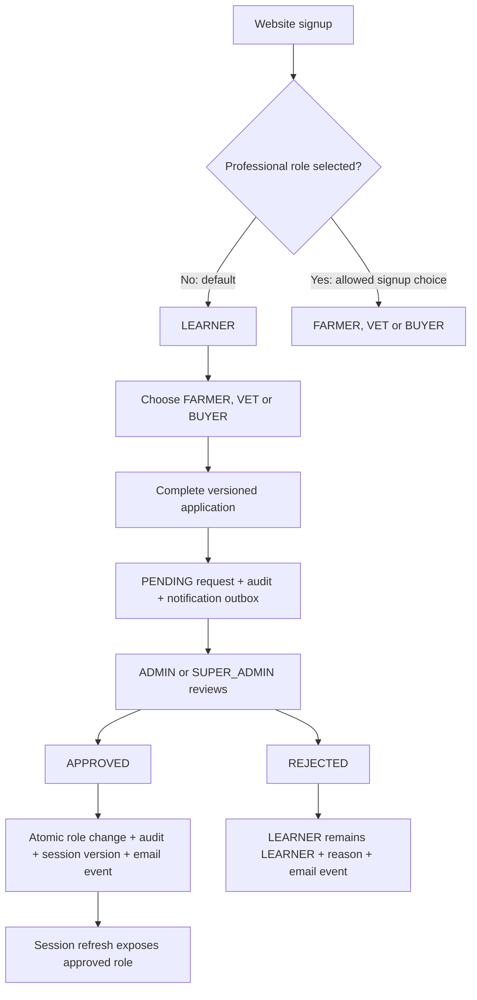

# User roles and professional-role approval specification

Status: **Implemented and locally verified, 2026-10-07; backend first, then frontend with Zod.**

Date: 2026-10-07. Inspected HEAD: `9db3062`, including the existing uncommitted web auth-modal work.

Authority: the user's attached request, headed "Review the current backend role and authentication system first", together with the latest LEARNER correction and signup-choice answer. [Existing modal specification](../../tasks/web-auth-modals/spec.md) still owns modal authentication, Bangla-first copy and the HttpOnly web session boundary. Original platform audience context: [product blueprint](../../../vetralink_pro_blueprint.md); backend auth/tenant history: [auth service](../../tasks/task-2.4-auth-service-core/spec.md), [roles guard](../../tasks/task-2.5-roles-guard/spec.md), [tenant guard](../../tasks/task-2.6-tenant-guard/spec.md).

**Latest user correction and clarified policy, 2026-10-07:** add **LEARNER**, replacing the attachment's proposed USER role. The user explicitly chose: "Signup-এ FARMER/VET/BUYER বাছা যাবে; role না দিলে LEARNER হবে". Therefore public signup may select FARMER/VET/BUYER, and omitted role defaults to LEARNER. This supersedes the attachment's mandatory ordinary-role-only signup and no-selector clauses. Retain professional applications for an existing LEARNER and all administrative restrictions. Implementation was subsequently authorized; no USER enum is used.

**Implementation authorization and additional requirement:** the user now authorizes required backend changes and subsequent frontend delivery. A new FARMER must finish farm onboarding immediately after successful signup before accessing a farm dashboard. Include FarmType, FarmRole and necessary farm details, owner-managed members, and Zod-based frontend form/response validation. This revokes the earlier planning-only approval boundary. Authentication stays modal-based.

## Review documents

| Document | Contents |
| --- | --- |
| [Current architecture and findings](current-state.md) | Actual roles, complete auth path, missing capabilities and evidence limits |
| [Backend plan](backend-plan.md) | Schema, endpoints, transactions, guards, email, migration, edge cases and tests |
| [Frontend plan](frontend-plan.md) | Signup/login modals, role applications, reviewer UI and privileged management |
| [Exact file/module impact](file-impact.md) | Existing files to change, new files to create and regression-only consumers |
| [Execution roadmap and review record](plan.md) | Dependency order, approval boundary and validation evidence |

Together these cover all 14 deliverables in the attached request. Implementation evidence and release limits are recorded in [operations](operations.md).

## Outcome and scope

Public website signup accepts an optional role from the exact allowlist `LEARNER`, `FARMER`, `VET`, `BUYER`; omission defaults to `LEARNER`. Backend validation rejects ADMIN/SUPER_ADMIN and unknown roles regardless of frontend choices. Internal/privileged creation may specify another explicitly authorized role; omission also defaults to LEARNER. The six canonical wire/database roles are `LEARNER`, `FARMER`, `VET`, `BUYER`, `ADMIN`, `SUPER_ADMIN`; existing uppercase values are retained. No existing account is reassigned merely because the default changes: stored accounts already have a role, and historical omission is not identifiable from the schema.

All six supported roles can sign in with valid credentials and an eligible account. Login is authentication, not an opportunity to select or change a role. Suspended/deleted accounts remain ineligible. Retain the current treatment of `PENDING_VERIFICATION` during this feature; a separate email-verification journey is not currently implemented and must not silently become a login prerequisite.

Only an active `LEARNER` may apply for one professional role: `FARMER`, `VET` or `BUYER`. An active `ADMIN` or `SUPER_ADMIN` reviews and approves/rejects the request. Approval changes the user's single platform role; rejection leaves it unchanged. Only an existing active `SUPER_ADMIN` may assign or remove administrative privilege. Every decision is enforced by the API and audited atomically.

Authentication remains in the existing sign-in/sign-up modal. Account applications and administrative work may have protected pages; there are no new `/login` or `/register` pages. Scope now includes mandatory farmer onboarding, farm discovery/dashboard entry and owner-managed members. Full operational animal/milk/clinical/commerce dashboards remain owned by their existing milestones.

## Farmer onboarding and member access

New FARMER signup and FARMER upgrade set server-owned `farmerOnboardingRequired = true`. Existing accounts retain their stored roles and are not forcibly marked incomplete by migration. Current-user responses expose this flag; protected farm HTTP/sync/socket operations check its live value. Closing the onboarding UI, changing browser state or providing a farm header cannot bypass it.

Onboarding offers creating an owned farm or confirming an existing authorized membership. New-farm input: name, FarmType, country, district, upazila, address, AnimalSpecies list, current animal count, experience years, optional paired GPS coordinates, and submission key. The server derives ownerId and assigns OWNER membership atomically with the farm, completed-onboarding record, cleared flag and audit. FarmRole is shown as OWNER for new-farm creation; it is not a client-selected platform or ownership privilege. Joining uses an existing own membership's server-returned FarmRole/FarmType and requires explicit confirmation; it cannot join an arbitrary farm or select its role.

Owner member management accepts an existing account email or UUID and all four FarmRole values (OWNER, MANAGER, HERDSMAN, VET_STAFF). Only an OWNER can grant OWNER; a manager cannot grant OWNER. The farm's primary ownerId remains unchanged. Validate target active account, tenant, caller membership and quotas; creation and audit share a transaction. This is not an email-invitation/account-creation feature.

Frontend form/response validation uses shared Zod schemas, including auth, questionnaires, onboarding, members and admin actions. The backend independently enforces permissions, strict DTOs/schema validation and database constraints.

## Proposed role and permission model

Keep one platform role per user. Farm membership remains a separate `FarmRole` relationship; subscription/payment entitlement remains separate from both. No new role hierarchy, multi-role table or configurable permission editor is required.

| Capability | LEARNER | FARMER | VET | BUYER | ADMIN | SUPER_ADMIN |
| --- | --- | --- | --- | --- | --- | --- |
| Public discovery; own account; logout | Yes | Yes | Yes | Yes | Yes | Yes |
| Apply for FARMER/VET/BUYER; view own application | Apply + history | History | History | History | History | History |
| Operational farm records/staff/sync | No | Membership + farm permissions | Membership/assignment + farm permissions | Preserve existing membership-based staff access | Existing explicit support permissions; membership where currently required | Existing explicit support/tenant permissions |
| Vet clinical/availability features | No | Existing farmer read/participant paths only | Existing VET + attending-vet/domain checks | Existing authorized read paths only | Existing explicitly permitted clinical/support paths | Existing explicitly permitted clinical/support paths |
| Learning/paid checkout/subscription | Existing authenticated purchase rules | Existing purchase rules | Existing purchase rules | Purchase rules | Existing purchase rules | Existing purchase rules |
| Read owned orders/library or already-paid entitlement | Ownership/entitlement | Ownership/entitlement | Ownership/entitlement | Ownership/entitlement | Existing explicit preview/support policy | Existing explicit preview/support policy |
| Review professional applications | No | No | No | No | Yes | Yes |
| Assign/remove ADMIN or SUPER_ADMIN | No | No | No | No | No | Yes, reauthenticate and protect last active super admin |
| Directly change one's own platform role | No | No | No | No | No | No |

**Implemented policy:** LEARNER has account/learning/discovery/application access; existing authenticated purchase and paid-entitlement rules continue, but LEARNER cannot start professional farm/clinical work. Existing BUYER farm-staff membership access and existing ADMIN clinical exceptions are preserved because the current backend supports them; tightening those unrelated permissions would require a separate explicit decision. Existing purchases remain readable after any demotion. There is no implicit grant of farm ownership, consultation assignment, subscription or paid content on role approval.

There are two permitted professional-entry paths: explicit professional selection at signup, and reviewed LEARNER upgrade. Signup selection is self-reported and does not prove qualifications. Manual VET verification in the application flow must not be described as verification of every self-registered VET. Preserve current direct professional registration behavior under the user's clarified policy; any platform-wide clinical credential requirement needs its own approved policy and compatibility plan.

New administrative routes use exact role allowlists and service-level checks. Remove the generic SUPER_ADMIN bypass in `RolesGuard`; explicitly name SUPER_ADMIN on administrative/support routes that should admit it. A SUPER_ADMIN is not allowed to use LEARNER-only application submission simply because it has the highest privilege. Existing intentional tenant/support bypasses are inventoried and tested, not expanded.

## Professional application questionnaire

The API owns a versioned, typed questionnaire catalogue. Labels/help/validation support `bn` and `en`; keys, types, enumerations and required fields are stable across locales. The frontend renders the supported fields and the backend validates independently. Implemented initial `questionnaireVersion = 1`:

| Target | Required answers | Optional answers | Approval prerequisite |
| --- | --- | --- | --- |
| FARMER | Farm/operation name; district and upazila; farm type from existing `FarmType`; species from existing `AnimalSpecies`; current/planned animal count; experience in years; application reason; truthfulness consent | Brief existing/planned operation description | Reviewer assesses the application; approval alone creates no farm or OWNER membership |
| VET | Professional name; qualification; licensing body and license/registration number; practice district; experience in years; supported species/specialties; application reason; truthfulness consent | Clinic/organization name | Reviewer records a verification note explaining manual qualification/license checks; merely entering a number never counts as verification |
| BUYER | Personal/business use; district; learning/purchase interests; application reason; truthfulness consent | Organization name when relevant | Reviewer assesses intended use; approval creates no payment/entitlement |

All text is plain text with explicit minimum/maximum lengths; no arbitrary HTML, URLs or object keys. Numeric ranges, enumeration lists and maximum array lengths are published by the catalogue and checked server-side. Limit the complete application body to 32 KiB, text answers to 1,000 characters, and the reason to 20–1,000 characters. Questions may apply stricter limits. No identity-document upload or automated licensing-provider integration is implied by this feature. The version-1 catalogue and shared schemas own the implemented wording and limits.

Persist the questionnaire version and accepted answer snapshot. Historical review must use that version, not reinterpret an old application with new questions. Reject an unsupported/stale version with a stable error and provide the current catalogue. Do not discard answers in the UI on that error.

## Workflow and state transitions

1. Derive applicant identity from the authenticated principal, never `userId` in the body. Check current role/status in storage. Professional target enum accepts only FARMER/VET/BUYER.
2. Validate exact questionnaire/version/answers and caller-scoped submission idempotency key. One pending request per user across all three targets is enforced by a database partial unique index.
3. Store PENDING request, minimal audit event and durable notification event in one transaction. A queue/provider outage does not lose the application or undo a successful submission.
4. Active reviewers receive a minimal email with a protected review link. The admin queue is authoritative even if email delivery fails.
5. Review shows submitted answers, version, applicant identity/current role/status, previous application history, date and decision history. No token/password/raw phone/encryption fields appear.
6. Approval locks and rechecks reviewer, applicant and request, checks expected versions, then atomically updates role, role/session versions, decision, audit and applicant notification. VET approval also creates/updates its profile through a transaction-aware repository, initially unavailable until availability is configured.
7. Rejection requires a public reason and optional private note; it records the decision/audit/email event and makes no role change. The applicant sees only the public reason. After rejection, an eligible LEARNER can create a corrected new request; old decisions remain immutable.
8. A committed role approval is visible on the next backend authorization check. Old access tokens fail the session-version check; a retained valid refresh token yields the new role. The UI revalidates on application-status refresh, visibility and cross-tab session events.

Statuses in the initial release are exactly `PENDING`, `APPROVED`, `REJECTED`. There is no edit-after-submission, silent withdrawal, auto-approval or transition between professional roles. If privileged role assignment makes a pending application obsolete, reject it atomically with public reason `ROLE_CHANGED`; do not leave an unapprovable pending request indefinitely.

## Administrative privilege management

Only a current active SUPER_ADMIN can list administrative access and mutate privileged roles. The mutation has an explicit target ID, expected target role version, reason and fresh actor-password confirmation. It never accepts a client-supplied actor identity. Recheck the actor and target inside the write transaction after password verification.

Allow granting ADMIN/SUPER_ADMIN to an existing active user and switching between those two roles. Removing privilege restores the stored previous non-administrative role, or LEARNER when there is no recorded previous role. The client cannot choose an arbitrary professional fallback and thereby bypass application approval. Do not offer arbitrary professional-to-professional reassignment.

Reject self-modification and any mutation leaving zero active, non-deleted SUPER_ADMIN accounts. Serialize all privileged-management operations using one database advisory lock plus consistent user/request row lock ordering. All future suspension/deletion operations affecting privileged accounts must share this invariant. This feature does not create a general suspension/deletion API.

Privilege changes increment role/session versions, revoke refresh tokens and emit audit/notification events atomically. Affected users must sign in again. An initial SUPER_ADMIN is provisioned only by a separately authorized, idempotent deployment/operator script with an explicit existing-account ID and audit record; there is no public bootstrap endpoint, automatic seed or hardcoded credential.

## Security and acceptance

Backend storage is authoritative for role/status/session version; signed JWT claims alone are insufficient for current authorization. Retain signature/expiry verification and add runtime claim validation. Unknown roles, deleted/suspended users, malformed claims and invalid session versions fail closed. WebSocket authorization must also recheck live permissions and stop delivering data to invalidated sockets.

No current self-profile write endpoint exists. If one is introduced later, it has a dedicated name/avatar/contact allowlist and forbids role, status, verification and security-version fields. Tests cover the user's attempted `PATCH /users/me { role: "ADMIN" }` against the absence of that route and against any future profile contract; it must never become a generic repository update route.

Acceptance requires all six-role auth tests, direct API authorization tests independent of the UI, concurrent submission/decision/privilege/refresh tests against disposable PostgreSQL, durable notification recovery, real sandbox provider evidence, bilingual rendered UI/accessibility checks, existing tenant/clinical/orders/sync regressions, and a staged migration rehearsal. Builds or mock mail delivery alone do not establish operational readiness. Detailed scenarios and rollout limits are in the separate plans.

## Explicit boundaries and unknowns

Production role counts, initial SUPER_ADMIN availability, actual mail credentials/delivery, configured token lifetimes, persistent worker/realtime hosting and real database state are **Unknown** in this review. No production data, secrets or environment files were read. The plan must verify these deployment prerequisites before release. Historical self-registered professional users are preserved; their qualification trust is an existing risk requiring a reviewed audit/remediation policy, not an automatic destructive migration.

The earlier planning-only task made no application changes. The latest user instruction authorizes implementation of this amended specification, backend first and frontend using Zod. Preserve prior auth-modal work and human-managed Git policy; production deployment/migrations remain separate operational actions.
