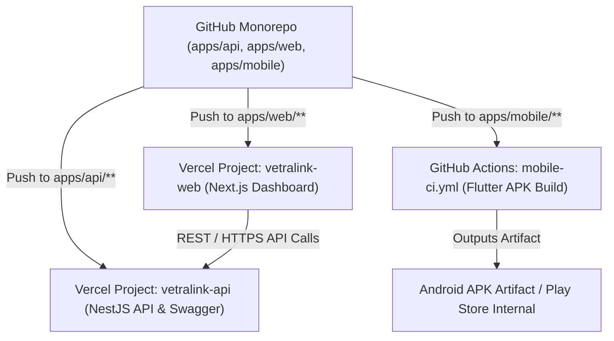

# VETRALINK PRO — Independent Platform-Wise CI/CD & Deployment Specification
# Version: 1.0.0 | Date: 2026-10-04 | Task: monorepo-ci-cd-platform-deployment

---

## 1. Feature Overview & Objective

### 1.1 Objective
Establish an enterprise-grade, platform-isolated CI/CD and deployment architecture for the VETRALINK PRO monorepo containing:
1. **Backend API Gateway**: NestJS (`apps/api`)
2. **Web Application**: Next.js 14 (`apps/web`)
3. **Mobile Application**: Flutter 3.x (`apps/mobile`)
4. **Shared Contracts**: Universal DTOs & Types (`packages/shared-types`)

Enable each platform to be developed in its own isolated folder, tested independently, and deployed to its target platform without triggering unwanted builds or coupling across projects.

---

## 2. Current State vs. Proposed Architecture

| Component | Current State | Proposed Standard State |
| :--- | :--- | :--- |
| **Code Organization** | All projects inside single repo under `apps/*` | Preserved clean monorepo with strict path-filtered workflows |
| **Backend Deployment** | Vercel serverless configured | Independent Vercel Project (`vetralink-api`) with `npx turbo-ignore` |
| **Web Deployment** | Unlinked / full monorepo build | Independent Vercel Project (`vetralink-web`) with `npx turbo-ignore` and env pointing to API |
| **Mobile Deployment** | Local manual builds only | Automated GitHub Actions workflow (`mobile-ci.yml`) compiling release APK/AAB |
| **CI Automation** | No GitHub Actions workflows | 3 isolated workflows with path triggers (`paths: ['apps/<target>/**']`) |

---

## 3. Platform-Wise Deployment Topology

---

## 4. Technical Contracts & Implementation Details

### 4.1 Path Filtering Workflows (`.github/workflows/`)
- `api-ci.yml`: Triggers on changes to `apps/api/**` or `packages/**`. Runs tests and Prisma verification.
- `web-ci.yml`: Triggers on changes to `apps/web/**` or `packages/**`. Runs lint and Next.js build.
- `mobile-ci.yml`: Triggers on changes to `apps/mobile/**`. Runs Flutter analyze, tests, and builds release APK.

### 4.2 Vercel Turbo-Ignore Configuration
Both Vercel projects (API and Web) use Turborepo's `turbo-ignore`:
- When committing code to `apps/web`, Vercel checks the API project with `npx turbo-ignore`. Turborepo detects `@vetralink/api` had no changes and cancels the API deployment immediately, preventing wasted build minutes.
- When committing code to `apps/api`, Vercel skips the Web build.
