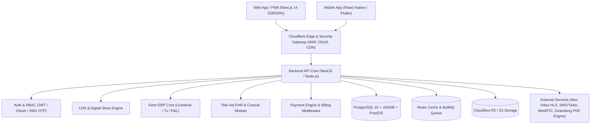
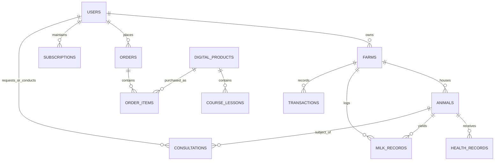

# VETRALINK PRO — Master Architecture & Development Blueprint

> **Source Document:** `vetralink_platform_specification.pdf` (Version 1.0 Production Blueprint)  
> **Target Market:** SME Dairy, Cattle, Goat & Poultry Farmers, Agropreneurs, and Veterinary Specialists.

---

## 1. Executive Overview & Value Proposition

VETRALINK PRO is a unified, cloud-native AgTech platform engineered to synthesize four core pillars:
1. **LMS / Educational Content:** Doctor-verified video courses, treatment guides, feed matrices.
2. **Digital Marketplace:** Encrypted eBooks & verified Excel ROI/feed templates.
3. **Multi-Species Farm SaaS ERP:** Offline-first livestock tracking (milk logs, vaccinations, expenses, P&L, FCR).
4. **Tele-Veterinary Consultations:** On-demand access to certified vets with linked Electronic Health Records (EHR) & digital signed prescriptions.

---

## 2. Technology Stack & System Architecture

### Technology Breakdown
- **Monorepo Strategy:** Turborepo with `pnpm` workspaces
- **Frontend (Web/PWA):** Next.js 14 (React, TypeScript, TailwindCSS)
- **Mobile Apps:** React Native (Expo) or Flutter with offline storage (SQLite / WatermelonDB)
- **Backend API:** Node.js (NestJS) TypeScript Monorepo
- **Primary Database:** PostgreSQL 16 (Relational + JSONB + PostGIS) via Prisma ORM
- **Cache & Message Queue:** Redis Cloud / Upstash + BullMQ
- **Object Storage & CDN:** Cloudflare R2 + AWS CloudFront
- **Video Bitrate Streaming:** Mux Video / Cloudflare Stream (HLS/DASH)
- **Payment Processing:** Stripe (Global) + SSLCommerz / bKash / Razorpay (Local MFS)
- **PDF Engine:** Gotenberg / Python worker for dynamic watermarking and prescription generation

---

## 3. Database Schema Blueprint (PostgreSQL 16)

### Core Data Models
- `users`: `id`, `phone`, `email`, `full_name`, `role` (farmer, vet, admin), `status`, `created_at`
- `farms`: `id`, `user_id`, `farm_name`, `farm_type` (dairy, poultry, goat, mixed), `location_address`, `geo_lat`, `geo_lng`
- `animals`: `id`, `farm_id`, `tag_number`, `species`, `breed`, `gender`, `dob`, `weight_kg`, `status` (active, sold, deceased), `meta_data` (JSONB)
- `digital_products`: `id`, `title`, `slug`, `type` (course, ebook, excel_tool), `price_cents`, `discount_price_cents`, `file_url`, `is_published`
- `subscriptions`: `id`, `user_id`, `plan_id`, `status` (active, past_due, cancelled), `current_period_start`, `current_period_end`, `animal_limit`
- `health_records`: `id`, `animal_id`, `event_type` (vaccine, deworm, illness, surgery), `diagnosis`, `medicine_name`, `dosage`, `administered_by`, `next_due_date`
- `milk_records`: `id`, `farm_id`, `animal_id` (nullable for flock), `record_date`, `morning_liters`, `evening_liters`, `fat_percentage`, `total_liters`
- `consultations`: `id`, `farmer_id`, `vet_id`, `animal_id`, `chief_complaint`, `media_urls` (JSONB[]), `status`, `diagnosis`, `prescription_pdf_url`

---

## 4. 14-Week Development Roadmap

### Sprint 0: Architecture & Setup (Weeks 1 - 2)
- Monorepo setup (Turborepo with Next.js 14, NestJS, Shared TS Types)
- Database schema migration & seeds (Prisma + PostgreSQL)
- CI/CD automated pipeline (GitHub Actions -> Docker)
- Authentication service (JWT, SMS OTP, Passwordless)

### Sprint 1: Digital Commerce & LMS (Weeks 3 - 5)
- Course catalog & HLS video streaming integration (Mux / Cloudflare Stream)
- Digital Store for eBooks & Excel toolkits
- Dynamic PDF watermarking micro-worker (Gotenberg / Python)
- Payment Gateway Integrations (Stripe + bKash / SSLCommerz webhooks)
- User Library & Order History Dashboard

### Sprint 2: Farm ERP Core Engine (Weeks 6 - 9)
- Farm Workspace setup & Multi-Species animal registry
- Daily milk production logging & interactive aggregate yield charts
- Vaccination & Deworming schedule tracker with SMS reminders
- Farm Financial Ledger (Feed expenses, livestock sales, Net P&L)
- Subscription tier quota enforcer (Basic: 25, Pro: 150, Premium: Unlimited)

### Sprint 3: Tele-Vet Module (Weeks 10 - 12)
- Consultation Request pipeline with image/video attachments
- Doctor Portal & Dashboard (Case review, patient EHR history view)
- Digital Prescription Builder (Auto-generates signed PDF, appends to animal medical record)
- In-app real-time messaging / WebSockets channel

### Sprint 4: QA, Security & Launch (Weeks 13 - 14)
- End-to-end integration testing & load testing (k6)
- Security audit (OWASP Top 10, SQL injection, signed S3 URLs)
- Offline PWA caching tuning for low-bandwidth rural environments
- Production deployment & monitoring setup (Sentry, Prometheus)

---

## 5. Commercial Pricing & Subscription Tiers

| Plan | Target Audience | Included Capabilities | Pricing |
| :--- | :--- | :--- | :--- |
| **Starter / Free** | Smallholder / Hobbyist (1-5 animals) | Basic animal records, community guides, access to shop | Free forever |
| **Pro Farmer** | Commercial Small Herd (Up to 30 animals) | Full Health & Breeding tracking, Milk logging, P&L Reports, SMS Alerts | $9 / mo ($89 / yr) |
| **Commercial Enterprise** | Large Dairy / Poultry (Unlimited animals) | Multi-user staff access, advanced batch analytics, priority Tele-Vet, custom export | $29 / mo ($289 / yr) |
| **Pay-Per-Consult** | Any registered farmer | 1-on-1 Certified Vet consultation + Official Digital Prescription | $5 - $15 / consult (80/20 split) |
